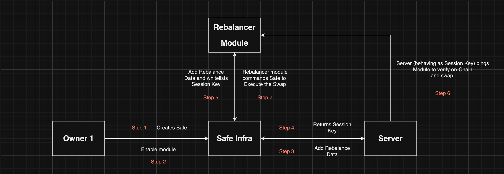

# Safe Rebalancer

This is a POC of an app that can automatically change the balance of the tokens in a Gnosis Safe wallet if certain triggers are met.

## Architecture



## Components

1. [Contracts](https://github.com/iamyxsh/safe-rebalancer/tree/master/contracts)
2. [Server](https://github.com/iamyxsh/safe-rebalancer/tree/master/server)
3. [Script](https://github.com/iamyxsh/safe-rebalancer/tree/master/scripts)

## Running Tests

To run tests, run the following command

```bash
  cd contracts && forge test --rpc-url <your node URL to forked mainnet>

```

## Run Locally

Clone the project

```bash
  git clone https://github.com/iamyxsh/safe-rebalancer.git
```

Go to the project directory

```bash
  cd safe-rebalancer
```

Start Forked Blockchain

```bash
  yarn blockchain
```

Start the server

```bash
  yarn server
```

## Features

- [x] Rebalncer Module

- [x] Session Key Generation

- [x] Whitelisting Session Key

- [x] On-Chain Validation

- [x] Server Cron Jobs

## To Do List

[ ] More Secure Session Key (Maybe AWS KMS)

[ ] An individual Session Key Manager Contract

[ ] Better Off-Chain Validation in the Cron Job

[ ] Gas Less Execution of Rebalancing (Maybe Smart Wallet of Session Keys)

[ ] Better management of every token pair

## Authors

- [@iamyxsh](http://iamyxsh.dev)
